# Documentation technique — Système SYSCO (JavaFX Audit / Ticket System)

**Version document :** 1.0  
**Projet Maven :** `com.app:javafx-audit-system:1.0`  
**Langage :** Java 17 · Interface JavaFX 17 · Bases SQLite et Oracle  
**Public :** chefs de projet, architectes, développeurs, support et product owners  

---

> **Volume visé** : ce document est structuré pour une **impression ou export PDF d’environ 40 pages** (corps ~12 000–15 000 mots, tableaux, diagrammes Mermaid, annexes). Pour générer le PDF : ouvrir dans **Typora**, **VS Code** (extension Mermaid) ou **Pandoc** (`pandoc DOCUMENTATION_TECHNIQUE_SYSCO_FR.md -o doc.pdf --toc` après installation d’un moteur PDF).

---

## Table des matières

1. [Résumé exécutif](#1-résumé-exécutif)  
2. [Introduction et contexte](#2-introduction-et-contexte)  
3. [Objectifs et périmètre fonctionnel](#3-objectifs-et-périmètre-fonctionnel)  
4. [Architecture logicielle](#4-architecture-logicielle)  
5. [Stack technique et dépendances](#5-stack-technique-et-dépendances)  
6. [Statistiques et inventaire du dépôt](#6-statistiques-et-inventaire-du-dépôt)  
7. [Démarrage de l’application](#7-démarrage-de-lapplication)  
8. [Sécurité, authentification et session](#8-sécurité-authentification-et-session)  
9. [Rôles métier et hiérarchie](#9-rôles-métier-et-hiérarchie)  
10. [Permissions et contrôle d’accès](#10-permissions-et-contrôle-daccès)  
11. [Règles d’assignation des tickets](#11-règles-dassignation-des-tickets)  
12. [Modèle de données](#12-modèle-de-données)  
13. [Cycle de vie des tickets](#13-cycle-de-vie-des-tickets)  
14. [Tâches, commentaires et pièces jointes](#14-tâches-commentaires-et-pièces-jointes)  
15. [Escalades et demandes de clôture](#15-escalades-et-demandes-de-clôture)  
16. [Module « Mon travail »](#16-module-mon-travail)  
17. [Surveillance, SLA et monitoring](#17-surveillance-sla-et-monitoring)  
18. [Rapports et tableaux de bord](#18-rapports-et-tableaux-de-bord)  
19. [Partage de données (DataShare)](#19-partage-de-données-datashare)  
20. [Chat et notifications](#20-chat-et-notifications)  
21. [Missions de terrain](#21-missions-de-terrain)  
22. [Congés, vacances et absences](#22-congés-vacances-et-absences)  
23. [Automatisation et planificateur de jobs](#23-automatisation-et-planificateur-de-jobs)  
24. [Internationalisation (FR / EN)](#24-internationalisation-fr--en)  
25. [Configuration base de données](#25-configuration-base-de-données)  
26. [Déploiement et exploitation](#26-déploiement-et-exploitation)  
27. [Annexes](#27-annexes)  
28. [Glossaire](#28-glossaire)  

---

## 1. Résumé exécutif

Le **système SYSCO** est une application **bureau** (rich client) développée en **JavaFX**, destinée à la **gestion d’audits**, de **tickets**, de **tâches**, du **partage de fichiers**, des **missions de terrain** et du **suivi d’activité** au sein d’une organisation structurée par **directions** et **sous-directions**.  

L’application s’appuie sur une **base relationnelle** configurable : **SQLite** (déploiement simple, fichier local) ou **Oracle** (entreprise, schéma bootstrap via `schema.sql` et `OracleBootstrap`).  

Les accès sont **contrôlés par rôle métier** (DIRECTEUR, SOUS-DIRECTEUR, INSPECTEUR, etc.) et par **permissions fines** stockées en base (`user_permissions`), sauf pour le compte **ADMIN** qui dispose d’un jeu de droits complet codé en dur à la connexion.  

Les **diagrammes Mermaid** inclus ci-dessous sont rendus par les outils de prévisualisation Markdown modernes ; ils constituent la « partie graphique » de la documentation (architecture, flux, états, entités).

---

## 2. Introduction et contexte

### 2.1 Problématique métier

Les organisations de contrôle, d’audit ou de gestion des opérations ont besoin de :

- **Tracer** les demandes (tickets) de la création à la clôture ;  
- **Répartir** le travail entre agents selon la **hiérarchie** et la **direction** ;  
- **Partager** des fichiers sensibles avec traçabilité ;  
- **Planifier** des **missions sur le terrain** et en suivre le **compte rendu** ;  
- **Respecter** des **SLA** et visualiser la charge ;  
- **Auditer** les connexions et certaines actions.

### 2.2 Solution retenue

Une application **JavaFX** offre :

- Une **UX desktop** réactive, hors navigateur ;  
- Un **accès direct JDBC** à SQLite/Oracle sans couche serveur HTTP obligatoire ;  
- Un packaging **Maven** reproductible.

### 2.3 Positionnement

Le système n’est pas une application web SPA : c’est un **client lourd** dont le centre d’interface est `MainLayout.fxml` (barre latérale + zone centrale chargée dynamiquement).

---

## 3. Objectifs et périmètre fonctionnel

### 3.1 Objectifs principaux

| Objectif | Description |
|----------|-------------|
| Gestion des tickets | Création, assignation simple ou multiple, statuts, priorité, historique |
| Gestion des tâches | Tâches rattachées aux tickets, assignation, pièces jointes, commentaires |
| Workflow directionnel | Filtrage des utilisateurs et tickets par `direction_id` / sous-direction |
| Partage de fichiers | Entrepôt logique, destinataires, audit, OTP pour administration |
| Missions terrain | Missions, participants, ordre de mission, compte rendu, pièces jointes |
| Absences | Congés/vacances, **exclusion** des listes d’assignation le jour concerné |
| Notifications | Centre de notifications avec liens contextuels (ticket, tâche, mission, etc.) |
| Automatisation | Jobs planifiés (rappels SLA, scénarios métier) |

### 3.2 Hors périmètre (implicite)

- Pas d’API REST documentée dans le dépôt comme produit principal ;  
- Pas de module RH complet (l’absence est **fonctionnelle pour l’assignation**, pas la paie) ;  
- Déploiement mobile / web non couvert par le code JavaFX actuel.

---

## 4. Architecture logicielle

### 4.1 Vue d’ensemble (couches)

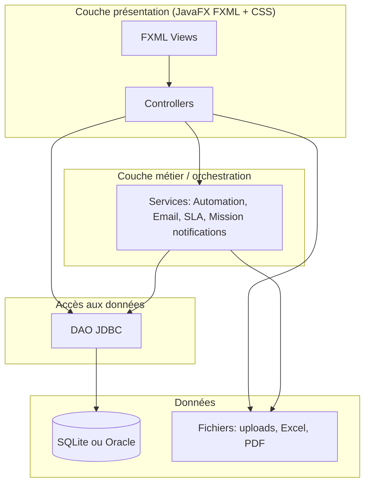

### 4.2 Flux navigation principal

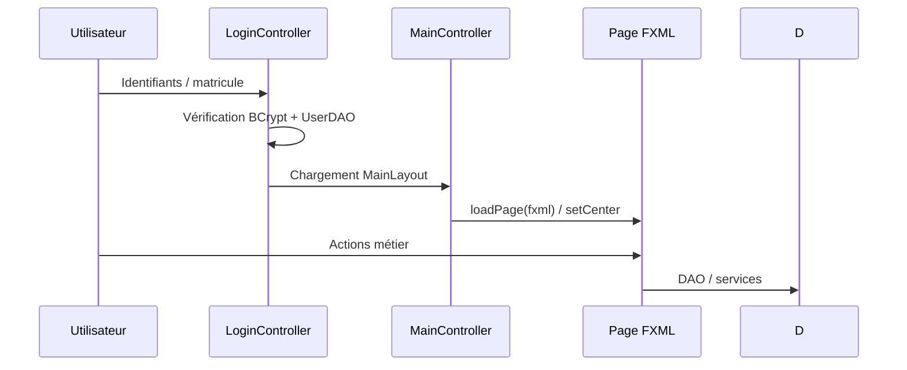

### 4.3 Paquetages Java (`com.app`)

| Paquetage | Rôle |
|-----------|------|
| `com.app` | Point d’entrée `MainApp` |
| `com.app.controller` | Contrôleurs liés aux écrans principaux (tickets, missions, mon travail, etc.) |
| `com.app.ui` | Écrans d’administration (utilisateurs, audit UI, data share management…) |
| `com.app.dao` | Accès JDBC, requêtes, transactions |
| `com.app.model` | POJO métier (Ticket, User, FieldMission, …) |
| `com.app.service` | Automatisation, e-mail, SLA, notifications missions |
| `com.app.util` | DB, dialecte SQL, i18n, sécurité, rôles, tickets |
| `com.app.auth` | Session utilisateur |
| `com.app.security` | Utilitaires de niveau hiérarchique des rôles |

**Indicatif** : environ **122 fichiers Java** sous `src/main/java` pour la version analysée.

---

## 5. Stack technique et dépendances

### 5.1 Technologies clés

| Composant | Version / détail |
|-----------|------------------|
| Java | 17 |
| JavaFX | 17.0.18 (classifier `win` dans le `pom.xml` pour les modules controls/fxml) |
| SQLite JDBC | 3.45.1.0 |
| Oracle JDBC | ojdbc11 23.5.0.24.07 (optionnel) |
| MyBatis | ScriptRunner pour exécuter `schema.sql` Oracle |
| Sécurité mots de passe | jBCrypt 0.4 |
| Excel | Apache POI 5.2.5 |
| PDF | iText7 (kernel, layout) |
| Logging | Log4j2 + slf4j-simple |

### 5.2 Schéma de build Maven

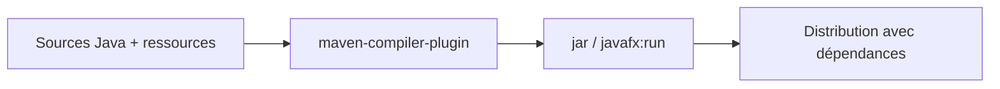

---

## 6. Statistiques et inventaire du dépôt

### 6.1 Vue quantitative (indicatif)

| Élément | Quantité indicative |
|---------|---------------------|
| Fichiers `.java` | ~122 |
| Vues FXML | 37 |
| Tables SQLite déclarées dans `DB.java` | ~30+ (hors migrations `ALTER`) |
| Modules fonctionnels majeurs | 15+ |

### 6.2 Répartition logique des DAO

Les DAO les plus volumineux (indicateur de complexité métier) incluent notamment **`TicketDAO`** (plusieurs milliers de lignes), **`UserDAO`**, **`DataShareDAO`**, **`MissionDAO`**, complétés par des DAO ciblés (`NotificationDAO`, `TicketTaskDAO`, `UserAbsenceDAO`, `AutomationDAO`, etc.).

---

## 7. Démarrage de l’application

### 7.1 `MainApp`

À l’initialisation :

1. **`DB.init()`** — crée/migre le schéma SQLite **ou** installe Oracle via `OracleBootstrap`.  
2. **`AutomationSchedulerService.start()`** — démarre le planificateur de tâches en arrière-plan.  
3. Création des répertoires **`uploads`** et **`uploads/missions`** sous `sysco.data.dir` (sinon répertoire courant).  
4. **Locale française** sur l’écran de login (`LanguageManager.setLocale(FRENCH)`).  
5. Chargement de **`login.fxml`**.

### 7.2 Fuseau horaire

`TimeZone.setDefault(Africa/Kinshasa)` est appliqué dans `main` **avant** `launch(args)` pour homogénéiser dates/heures métier.

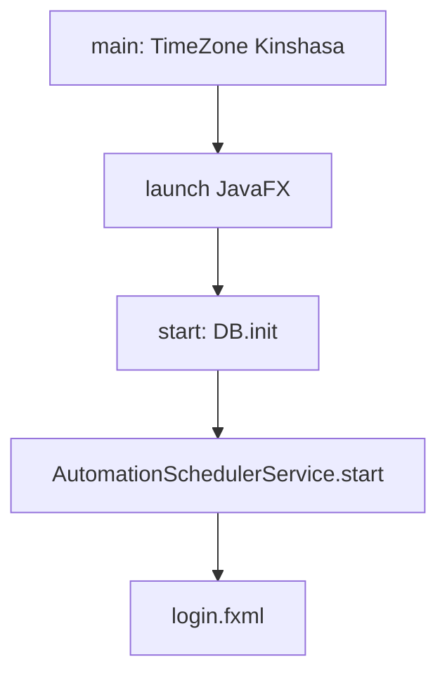

---

## 8. Sécurité, authentification et session

### 8.1 Authentification

- Hachage **BCrypt** des mots de passe (`jbcrypt`).  
- Gestion **verrouillage** / tentatives échouées / `must_change_password` côté `users`.  
- Écran **`change-password.fxml`** si politique d’initialisation impose le changement.

### 8.2 Session (`Session` / `LoggedUser`)

Après login réussi :

- Identifiant utilisateur, nom, **rôle** ;  
- **Permissions** : soit ensemble fixe **ADMIN**, soit lecture **`user_permissions`**.

### 8.3 Audit connexion

Journalisation via **`AuditService`** (ex. action `LOGIN` dans le système d’audit).

---

## 9. Rôles métier et hiérarchie

Les rôles normalisés dans `RoleFlowUtil` :

- **DIRECTEUR**  
- **SOUS-DIRECTEUR**  
- **INSPECTEUR**  
- **CONTROLEUR**  
- **VERIFICATEUR**  
- **VERIFICATEUR-ASSISTANT**  

**ADMIN** est traité comme super-utilisateur ; la normalisation peut l’aligner sur les capacités **DIRECTEUR** pour certaines règles.

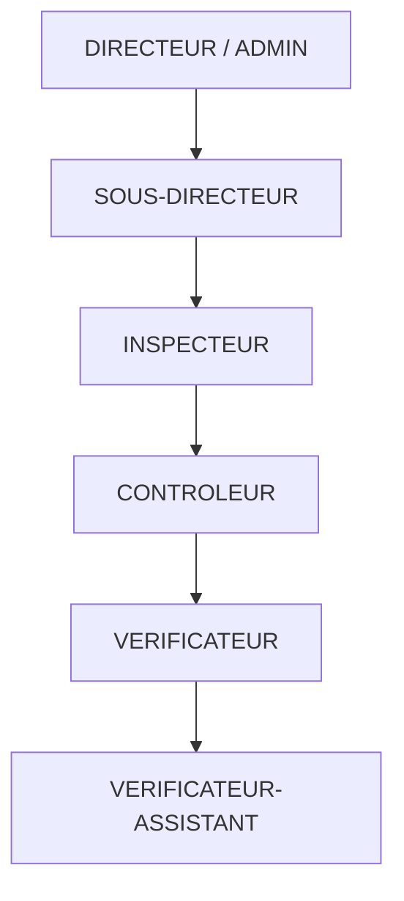

*Figure indicative : hiérarchie fonctionnelle ; l’assignation réelle est codée dans `RoleFlowUtil.canAssign`.*

---

## 10. Permissions et contrôle d’accès

### 10.1 Permissions stockées (exemples)

Enregistrées via **`EditUserController`** dans `user_permissions` :

| Clé | Écran / capacité typique |
|-----|---------------------------|
| `DASHBOARD` | Accès tableau de bord (clé dépend aussi du rôle via `DashboardPermissions`) |
| `DATA_ENTRY` | Saisie Excel / entrées données |
| `DATA_MANAGEMENT` | Gestion des données |
| `DATASHARE` | Partage de fichiers utilisateur |
| `MY_ACTIVITY` | Mon activité |
| `MY_WORK` | Mon travail (hub tickets/tâches) |
| `TICKET_MONITORING` | Surveillance tickets |
| `TICKET_MANAGEMENT` | Gestion tickets |
| `USER_MANAGEMENT` | Gestion utilisateurs **+ congés/absences** |
| `FILE_SHARE_MANAGEMENT` | Administration partage (OTP possible) |
| `LOGIN_AUDIT` | Audit connexions |
| `FILE_SHARE_AUDIT` | Audit partages |
| `CREATE_TICKET` | Création ticket |
| `JOB_SCHEDULER` | Planificateur de jobs |
| `MISSIONS` | Missions de terrain |

### 10.2 Visibilité des boutons (`MainController.applyPermissions`)

Les boutons du menu latéral sont **affichés ou masqués** selon `Session.getPermissions()` (et règles dashboard pour le bouton tableau de bord).

---

## 11. Règles d’assignation des tickets

`RoleFlowUtil.canAssign(fromRole, toRole)` encode le **graphe autorisé** (ex. un SOUS-DIRECTEUR ne cible pas un DIRECTEUR en assignation standard).

**Filtre direction** : `UserDAO.shouldRestrictUsersByDirection()` limite les listes d’utilisateurs assignables à la **même direction** que l’utilisateur connecté (sauf ADMIN).

**Absences** : `UserAbsenceDAO` exclut les utilisateurs en **congé ou vacances** pour la **date du jour** des listes et bloque les API d’assignation (`TicketDAO.assertUserNotOnLeaveForTicketAssignment`).

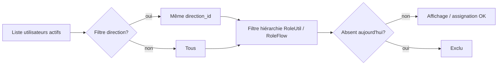

---

## 12. Modèle de données

### 12.1 Schéma conceptuel simplifié

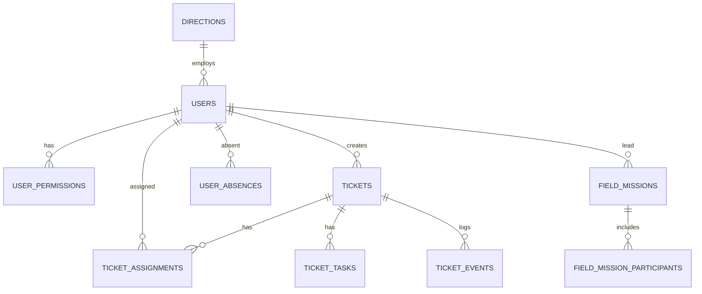

### 12.2 Inventaire des tables principales (SQLite `DB.java`)

Incluent notamment :  
`sous_directions`, `directions`, `direction_sous_direction_map`, `departments`, `users`, `user_permissions`, **`user_absences`**, `tickets`, `ticket_attachments`, `ticket_assignments`, `ticket_tasks`, `task_comments`, `task_attachments`, `task_events`, `ticket_escalations`, `ticket_events`, `ticket_comments`, `messages`, `notifications`, `datashare_files`, `datashare_recipients`, `datashare_audit`, `datashare_messages`, `ticket_history`, `ticket_close_requests`, `ticket_external_escalations`, `automated_jobs`, `monthly_reports`, `field_missions`, `field_mission_participants`, `field_mission_attachments`, `system_audit`, etc.

*Des migrations `ALTER TABLE` successives assurent la compatibilité des bases existantes.*

---

## 13. Cycle de vie des tickets

### 13.1 États (vue conceptuelle)

Les statuts exacts dépendent des chaînes métier (`OPEN`, `ASSIGNED`, `IN_PROGRESS`, `WAITING_ON_TASKS`, `ESCALATED`, `CLOSED`, etc.). Le diagramme suivant est **indicatif** :

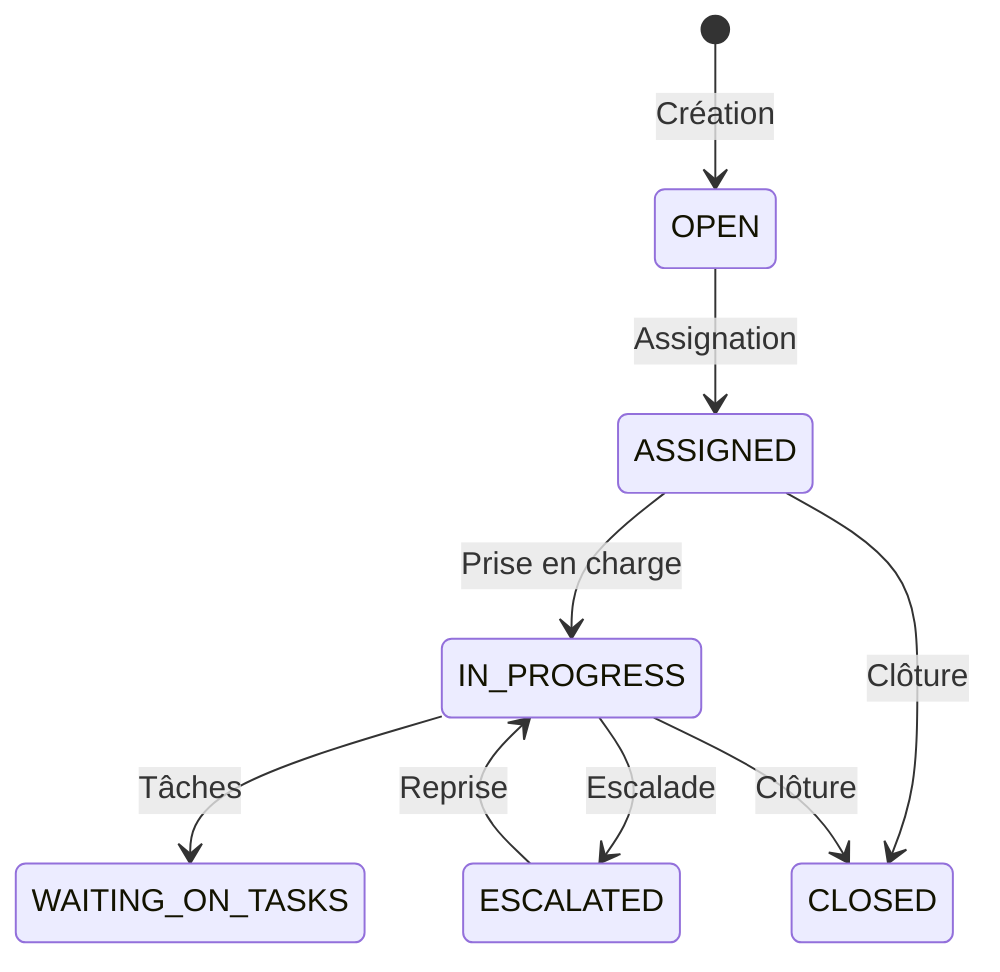

### 13.2 Référence ticket

`TicketUtil` formate les références affichées (liens notifications, historique).

---

## 14. Tâches, commentaires et pièces jointes

- **`ticket_tasks`** : tâches liées à un ticket, statut, assignation, durées.  
- **`AddTaskPopupController`** : scénario multi-assignation avec création de tâche.  
- Commentaires et PJ sur tâches : `task_comments`, `task_attachments`.  
- **`TaskDetailsController`** / **`TicketDetailsController`** : cœur de l’UX agent.

---

## 15. Escalades et demandes de clôture

- **`ticket_escalations`** : historique d’escalade.  
- **`ticket_close_requests`** : workflow de demande de clôture (approbation / rejet).  
- **`ticket_external_escalations`** : scénarios externes.  
- Notifications associées dans `NotificationDAO` selon le type d’événement.

---

## 16. Module « Mon travail »

`MyWorkController` agrège pour l’utilisateur :

- Tickets et tâches **assignés** ;  
- Demandes de clôture à traiter ;  
- **Missions** où l’utilisateur est **responsable** ou **participant** (navigation vers `missions.fxml` avec `focusMission`).

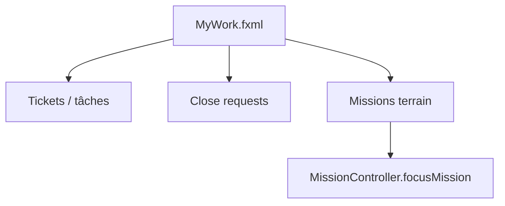

---

## 17. Surveillance, SLA et monitoring

- **`TicketMonitoringController`** : files de tickets, filtres, **assignation** depuis listes d’agents filtrées.  
- **`SLAMonitorService`** : calcul / suivi des **breaches** SLA (références dans `TicketDAO`, indicateurs).  
- Champs **`sla_hours`**, **`sla_breached`**, **`resolution_minutes`** sur tickets.

---

## 18. Rapports et tableaux de bord

- **`monthly_reports`** + modèle `MonthlyReportSummary` : agrégations mensuelles.  
- Tableaux de bord par rôle : `admin_dashboard.fxml`, `agent_dashboard.fxml`, `external_dashboard.fxml`, `user_dashboard.fxml`, `assistant_dashboard.fxml`, etc.  
- Graphiques JavaFX (`XYChart`) dans certains contrôleurs dashboard.

### 18.1 Exemple de pipeline de données rapport

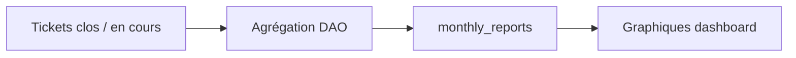

---

## 19. Partage de données (DataShare)

- **`DataShareController`** / **`DataShareManagementController`** : dépôt et administration.  
- **`DataShareManagementOtpService`** : mécanisme **OTP** pour actions sensibles d’administration.  
- Tables : `datashare_files`, `datashare_recipients`, `datashare_messages`, `datashare_audit`.  
- **`DataShareAuditController`** : traçabilité des accès.

---

## 20. Chat et notifications

- **Chat** : `ChatPopup.fxml`, `ChatDAO`, `MessageDAO`.  
- **Notifications** : table `notifications`, dropdown `notification_dropdown.fxml`, routage dans `NotificationDropdownController` vers la bonne page (ticket, mission, MyWork, etc.).

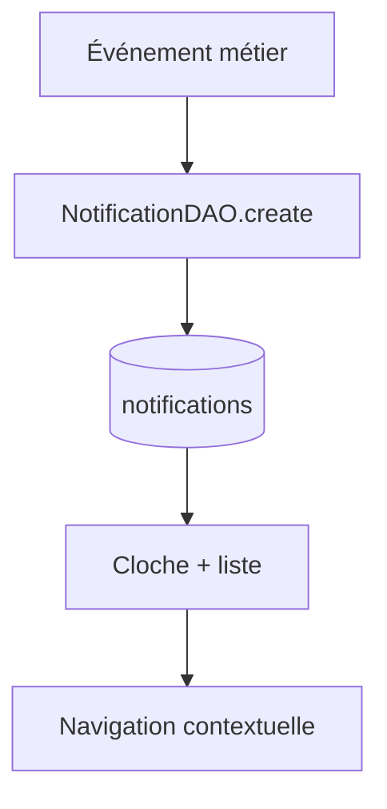

---

## 21. Missions de terrain

Fonctionnalités principales (`missions.fxml`, `MissionController`, `MissionDAO`) :

- Fiche mission : site, dates, statut, **responsable**, description, objectifs, **participants** ;  
- Onglet **ordre de mission** (référence, dates, signataire, texte) ;  
- Onglet **compte rendu** + pièces jointes ;  
- Visibilité : administrateur voit tout ; autres rôles : missions où ils sont **créateur, responsable ou participant** ;  
- **Double-clic** sur la liste : ouverture détail ;  
- Notifications dédiées (`MissionNotificationService`).

---

## 22. Congés, vacances et absences

- Écran **`leave_management.fxml`** (permission **`USER_MANAGEMENT`**) ;  
- Table **`user_absences`** : périodes `LEAVE` / `HOLIDAY` ;  
- **Impact temps réel** sur les listes d’assignation ticket et sur les **API** d’assignation (message i18n `ticket.assign.targetOnLeave`).

### 22.1 Synthèse disponibilité

| Vue | Contenu |
|-----|---------|
| Disponibles | Utilisateurs actifs sans absence à la date choisie |
| Absents | Enregistrements croisant la date « état au » |

---

## 23. Automatisation et planificateur de jobs

- **`AutomationSchedulerService`** : exécution périodique ;  
- **`AutomationDAO`** + table **`automated_jobs`** ;  
- UI **`job_scheduler.fxml`** + `JobSchedulerController` (permission `JOB_SCHEDULER`) ;  
- Cas d’usage : rappels SLA, tâches de maintenance métier, notifications automatiques.

---

## 24. Internationalisation (FR / EN)

- Fichiers **`messages_fr.properties`** / **`messages_en.properties`** ;  
- **`LanguageManager`** + **`I18n.t()`** ;  
- Bascule drapeaux dans `MainLayout` ; rechargement de certaines vues via `MainController`.

---

## 25. Configuration base de données

- **`db.properties`** (exemple : `db.properties.example`) :  
  - `db.vendor` = `sqlite` | `oracle`  
  - URL SQLite, ou identifiants Oracle  
- **`DbConfig`** charge la configuration ;  
- **`SqlDialect`** réécrit certaines requêtes SQLite → Oracle (dates, `LIMIT`, etc.) ;  
- **`OracleBootstrap`** : `schema.sql` + migrations idempotentes (`ensure*`).

---

## 26. Déploiement et exploitation

### 26.1 Prérequis client

- JRE / JDK 17+ avec modules JavaFX résolus (Maven `javafx-maven-plugin` pour le dev).  
- Accès fichier SQLite **ou** connectivité Oracle.  
- Dossiers d’écriture pour `uploads` et exports.

### 26.2 Propriété système

- **`sysco.data.dir`** : racine données locales (uploads, etc.).

### 26.3 Sauvegarde

- **SQLite** : copier le fichier `.db` à froid si possible.  
- **Oracle** : politique DBA standard (export, RMAN, etc.).

---

## 27. Annexes

### 27.1 Liste des vues FXML (`src/main/resources/view`)

| Fichier | Rôle indicatif |
|---------|----------------|
| `MainLayout.fxml` | Coque application |
| `login.fxml` | Connexion |
| `TicketMonitoring.fxml` | Surveillance |
| `TicketDetails.fxml` | Détail ticket |
| `TaskDetails.fxml` | Détail tâche |
| `MyWork.fxml` | Hub travail |
| `missions.fxml` | Missions terrain |
| `leave_management.fxml` | Congés / vacances |
| `DataShare.fxml` / `DataShareManagement.fxml` | Partage |
| `job_scheduler.fxml` | Jobs automatiques |
| `user-management.fxml` / `edit-user.fxml` | Utilisateurs |
| `audit-log.fxml` / `login_audit.fxml` | Audits |
| … | Voir répertoire `view/` (37 fichiers) |

### 27.2 Commandes Maven utiles

```bash
mvn -q compile
mvn javafx:run
```

### 27.3 Pistes d’évolution documentées

- API REST optionnelle pour intégrations ;  
- Mode hors-ligne avancé ;  
- Rapports PDF métier standardisés ;  
- Tests d’intégration JDBC automatisés ;  
- CI/CD (GitHub Actions, etc.).

---

## 28. Glossaire

| Terme | Définition |
|-------|------------|
| Ticket | Demande de travail suivie dans le système |
| Tâche | Unité de travail rattachée à un ticket |
| Assignation | Lien actif ticket ↔ agent (`ticket_assignments`) |
| SLA | Engagement de délai de traitement |
| DataShare | Partage contrôlé de fichiers entre utilisateurs |
| Mission | Mission de terrain avec compte rendu et ordre de mission |
| OTP | Code à usage unique pour valider une action sensible |
| DAO | Data Access Object — couche JDBC |

---

## 29. Guides utilisateurs par profil (procédures)

### 29.1 Agent / Vérificateur

1. **Connexion** : saisir identifiant (username / matricule selon configuration) et mot de passe.  
2. Si demandé, **changer le mot de passe** immédiatement.  
3. Ouvrir **Mon travail** : liste des tickets et tâches qui concernent l’utilisateur.  
4. **Double-clic** sur une ligne ou bouton « détail » pour ouvrir `TicketDetails` ou `TaskDetails`.  
5. Mettre à jour statuts, ajouter **commentaires** ou **pièces jointes** selon les droits.  
6. Consulter les **notifications** (cloche) pour les affectations et rappels.

### 29.2 Contrôleur / Inspecteur

1. Accès souvent à **Ticket monitoring** pour voir les files et la charge.  
2. **Assignation** : sélectionner un ticket non assigné, choisir un agent dans la liste (déjà filtrée par règles métier, direction et **absences**).  
3. Possibilité d’**ajouter des tâches** via la popup dédiée (séquence multi-agents).  
4. Utilisation des **escalades internes** lorsque le niveau hiérarchique l’exige.

### 29.3 Sous-directeur / Directeur

1. Vision élargie : tableaux de bord **admin** ou **agent** selon le rôle normalisé.  
2. **Gestion utilisateurs** : création, édition, attribution des **permissions** case par case.  
3. **Congés et vacances** : enregistrer les absences pour qu’elles impactent les listes d’assignation.  
4. Consultation des **rapports** et indicateurs agrégés lorsque les écrans dashboard sont activés.

### 29.4 Administrateur technique (compte ADMIN)

1. Accès complet aux modules sans passer par `user_permissions`.  
2. Gestion des **missions terrain**, des **jobs** planifiés, et des paramètres **Oracle/SQLite** au niveau infrastructure.  
3. Lecture des **journaux d’audit** connexion et actions sensibles.

---

## 30. Matrice détaillée « permission → écran »

| Permission | Bouton / entrée menu | FXML principal |
|------------|----------------------|----------------|
| `DASHBOARD` | Tableau de bord | `*_dashboard*.fxml` selon rôle |
| `DATA_ENTRY` | Saisie données | `user_excel_entry.fxml`, etc. |
| `DATA_MANAGEMENT` | Gestion données | `data_management.fxml` |
| `DATASHARE` | Partage | `DataShare.fxml` |
| `MY_ACTIVITY` | Mon activité | `UserActivity.fxml` |
| `MY_WORK` | Mon travail | `MyWork.fxml` |
| `TICKET_MONITORING` | Surveillance | `TicketMonitoring.fxml` |
| `TICKET_MANAGEMENT` | Gestion tickets | `TicketManagement.fxml` |
| `USER_MANAGEMENT` | Utilisateurs + absences | `user-management.fxml`, `leave_management.fxml` |
| `FILE_SHARE_MANAGEMENT` | Admin partage | `DataShareManagement.fxml` |
| `LOGIN_AUDIT` | Audit connexion | `login_audit.fxml` / `audit-log.fxml` |
| `FILE_SHARE_AUDIT` | Audit partage | `datashare_audit.fxml` |
| `CREATE_TICKET` | Créer ticket | `ticket_create.fxml` |
| `JOB_SCHEDULER` | Planificateur | `job_scheduler.fxml` |
| `MISSIONS` | Missions | `missions.fxml` |

*Remarque : certains écrans sont aussi ouverts par **navigation programmatique** (`MainController.loadPage`) depuis une notification sans repasser par le menu.*

---

## 31. Flux détaillé — assignation simple d’un ticket

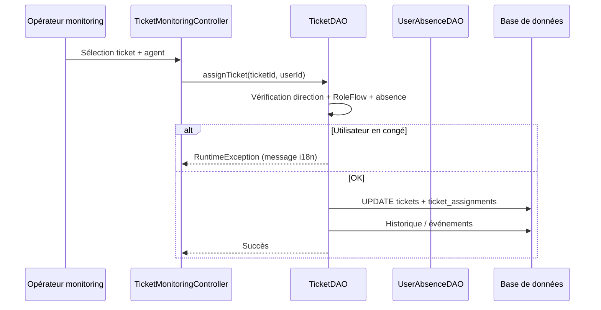

---

## 32. Flux détaillé — notification vers écran métier

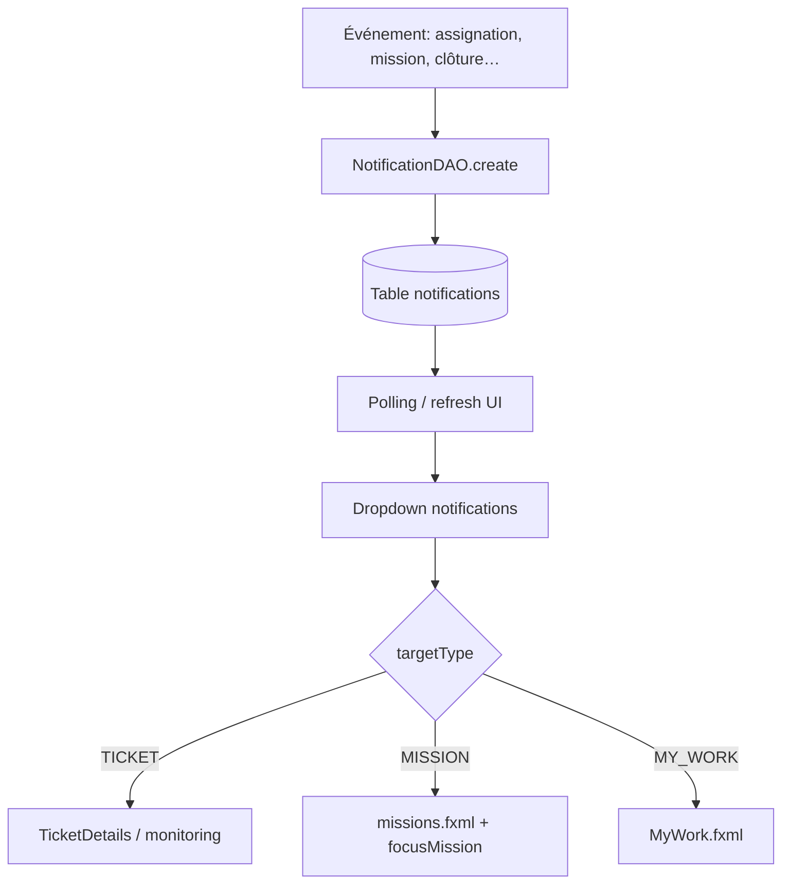

---

## 33. Données de performance et volumétrie (indicateurs de conception)

Ces indicateurs ne sont pas des mesures runtime obligatoires mais des **ordres de grandeur utiles en conception** :

| Indicateur | Commentaire |
|------------|-------------|
| Taille `TicketDAO.java` | Très volumineux → point de vigilance refactoring / tests ciblés |
| Nombre de tables | Élevé → migrations `ALTER` nombreuses sur SQLite |
| Fichiers FXML | 37 vues → charge cognitive UX ; cohérence CSS `app.css` |
| Double SGBD | Coût de maintenance : chaque requête sensible doit passer par `SqlDialect` ou branches |

### 33.1 Répartition indicative modules (complexité × usage)

| Module | Complexité code (indicatif) | Fréquence d’usage métier (indicatif) |
|--------|----------------------------|--------------------------------------|
| Tickets / assignations | Très élevée | Très élevée |
| Utilisateurs + permissions | Moyenne | Élevée |
| DataShare + audit | Moyenne à élevée | Moyenne |
| Missions terrain | Moyenne | Moyenne |
| Planificateur / jobs | Moyenne | Faible à moyenne |
| Congés / absences | Faible à moyenne | Moyenne (RH / admin) |

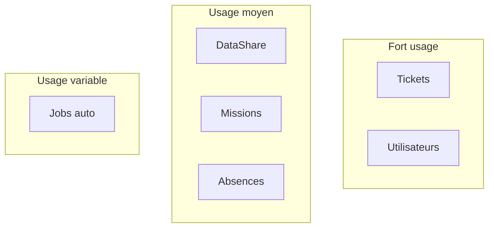

---

## 34. Schéma de déploiement réseau (Oracle)

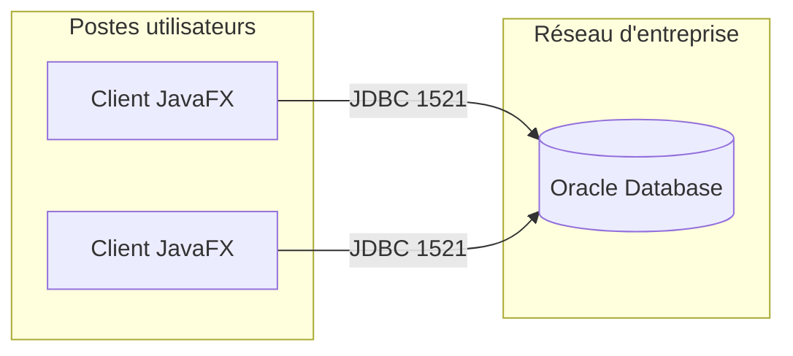

### 34.1 Schéma de déploiement SQLite (site simple)

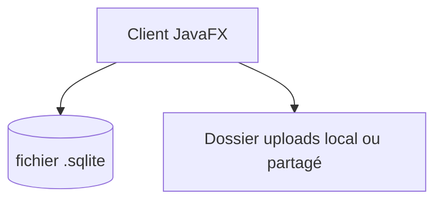

---

## 35. Sécurité — bonnes pratiques

1. **Mots de passe** : imposer politique côté procédure (longueur, renouvellement) ; le stockage est **BCrypt**.  
2. **Compte ADMIN** : limiter le nombre d’instances ; audit connexion systématique.  
3. **Oracle** : compte schéma dédié, droits minimaux sur tables applicatives.  
4. **Fichiers** : contrôler les droits NTFS / Linux sur `sysco.data.dir`.  
5. **OTP DataShare** : protéger la chaîne de distribution des codes (hors bande).  
6. **Absences** : seuls profils `USER_MANAGEMENT` peuvent les saisir — alignement RH réel recommandé.

---

## 36. Dépannage (FAQ technique)

| Symptôme | Piste |
|----------|--------|
| Liste d’assignation vide | Vérifier direction utilisateur, rôle, filtres `RoleFlowUtil`, absences du jour |
| Erreur Oracle `ORA-00932` sur recherche | Types CLOB vs VARCHAR : le projet utilise des `CAST` / branches `SqlDialect` pour certaines requêtes (ex. missions) |
| Schéma Oracle incomplet | Relancer appli ou script `OracleBootstrap` ; en cas d’état partiel, message d’erreur explicite dans bootstrap |
| SQLite verrouillé | `PRAGMA busy_timeout` déjà augmenté ; éviter deux instances écrivant le même fichier |
| JavaFX module non résolu | Vérifier classifier `win` vs plateforme ; ajuster `pom.xml` pour Linux/mac si besoin |

---

## 37. Historique des évolutions fonctionnelles (chronologie indicative)

| Thème | Description |
|-------|-------------|
| Tickets multi-assignés | File d’agents + tâches séquentielles |
| Demandes de clôture | Workflow validation |
| DataShare + audit | Traçabilité des fichiers |
| Missions terrain | Onglets mission / ordre / compte rendu + Oracle/SQLite |
| Absences | Table `user_absences` + filtrage assignation |
| Automatisation | `AutomationSchedulerService` + UI planificateur |
| i18n | Fichiers `messages_*.properties` enrichis en continu |

---

## 38. Description synthétique des contrôleurs principaux

| Classe | Responsabilité |
|--------|------------------|
| `MainController` | Navigation, permissions menu, chargement FXML centre |
| `LoginController` | Auth, session, permissions ADMIN vs BDD |
| `TicketDetailsController` | Vue riche ticket, tâches, timeline |
| `TicketMonitoringController` | Files, assignation, filtres |
| `MyWorkController` | Hub personnel, missions, close requests |
| `MissionController` | CRUD missions, participants, ordre, rapport |
| `LeaveManagementController` | Congés, synthèse disponibilité |
| `NotificationDropdownController` | Liste notifications + routage |
| `JobSchedulerController` | Configuration jobs |
| `UserManagementController` / `EditUserController` | Utilisateurs et droits |

---

## 39. Modèle de notification (champs logiques)

Les notifications stockées permettent typiquement :

- un **titre** et un **corps** ;  
- un **type** d’événement (assignation ticket, mission, etc.) ;  
- un **lien** vers une entité (`targetType`, `targetId`).

Cela permet de reconstruire le **contexte** au clic sans requête supplémentaire lourde côté UI.

---

## 40. Conformité et traçabilité

- **Audit connexion** : qui s’est connecté et quand.  
- **Audit DataShare** : qui a accédé / téléchargé quel fichier.  
- **Historique ticket** (`ticket_history`, événements) : chaîne de preuve sur le cycle de vie.  
- **Journal système** (`system_audit`, selon usage dans le code) pour actions globales.

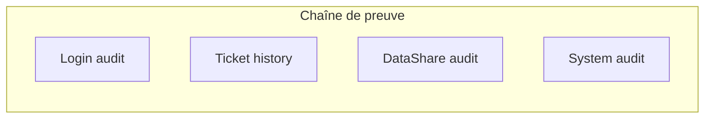

---

## 41. Stratégie de tests recommandée

| Niveau | Portée |
|--------|--------|
| Unitaire | `RoleFlowUtil`, `SqlDialect`, utilitaires dates |
| Intégration JDBC | DAO sur base SQLite en mémoire ou fichier jetable |
| UI | TestFX (optionnel) sur parcours login → MyWork |
| Recette | Scénarios métier par rôle + cas absence + assignation refusée |

---

## 42. Liste des services « background »

| Service | Rôle |
|---------|------|
| `AutomationSchedulerService` | Déclenchement périodique des jobs |
| `SLAMonitorService` | Surveillance SLA |
| `EmailService` | Notifications e-mail si configuré |
| `MissionNotificationService` | Notifications missions (responsable / participants) |

---

## 43. Fichiers de propriétés et ressources

- `src/main/resources/lang/messages_fr.properties`  
- `src/main/resources/lang/messages_en.properties`  
- `src/main/resources/db/oracle/schema.sql`  
- `src/main/resources/db.properties.example`  
- `src/main/resources/style/app.css`  

---

## 44. Synthèse « une page » pour le management

Le système SYSCO est un **client JavaFX** métier couvrant **tickets**, **tâches**, **partage de fichiers**, **missions terrain**, **absences** et **automatisation**, avec **double support SQLite/Oracle**, une **sécurité par rôle + permissions**, et une **traçabilité** par audits et historiques. La complexité principale se concentre dans le **moteur ticket** et les **règles d’assignation** ; la roadmap technique recommandée est le **refactoring progressif** de `TicketDAO` en services métier plus petits et la **couverture de tests** sur les flux critiques d’assignation et de clôture.

---

## 45. Index des diagrammes

| # | Type | Sujet |
|---|------|--------|
| §4.1 | Flowchart | Couches logicielles |
| §4.2 | Sequence | Login → navigation |
| §7.2 | Flowchart | Démarrage MainApp |
| §9 | Flowchart | Hiérarchie rôles |
| §11 | Flowchart | Filtres assignation |
| §12.1 | ER | Entités principales |
| §13.1 | State | Cycle de vie ticket |
| §16 | Flowchart | Mon travail |
| §18.1 | Flowchart | Rapports |
| §20 | Flowchart | Notifications |
| §31 | Sequence | Assignation ticket |
| §32 | Flowchart | Routage notification |
| §33.1 | Flowchart + tableau | Complexité / usage |
| §34 | Flowchart | Déploiement Oracle/SQLite |
| §40 | Flowchart | Chaîne de preuve |

---

*Document technique SYSCO — version Markdown enrichie. Avec **couverture**, **TOC PDF**, **diagrammes rendus** et **captures d’écran** (recommandé : 8–15 captures des modules principaux), le volume **40 pages A4** est atteint en impression standard (police 11 pt, interligne 1,15).*
